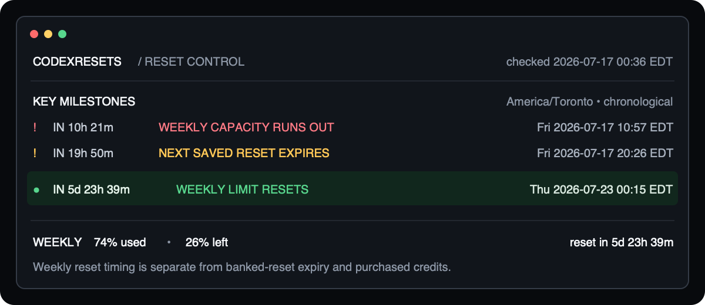
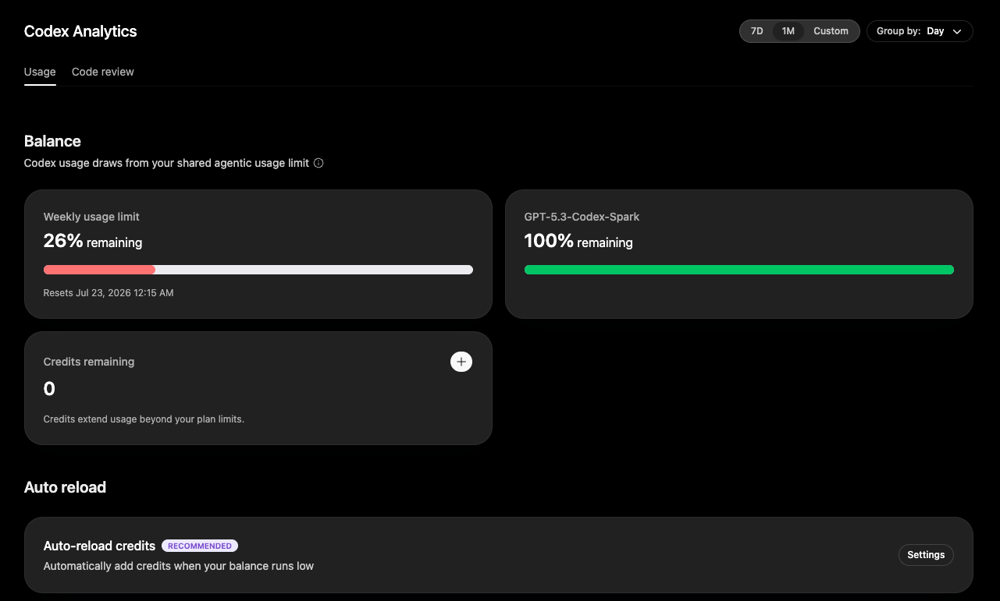

# CodexResets

CodexResets is a safe-by-default CLI and Codex plugin for checking exactly when your Codex usage windows reset. It leads with the five-hour and weekly limits, shows remaining capacity, and keeps natural usage resets separate from banked full-reset expiry dates and purchased credits. When a banked reset is actually due, an interactive session can ask for permission and use it only after explicit approval.

> [!IMPORTANT]
> CodexResets is an independent community project, not an official OpenAI product. It uses undocumented ChatGPT endpoints that may change. Use `/usage` in the Codex TUI for the supported OpenAI experience.

## What it shows

- The exact next five-hour and weekly limit reset dates in your selected time zone
- Remaining capacity, reset countdowns, pace confidence, and clear `ON TRACK` or `AT RISK` labels
- A decision-first recommendation to use, keep, or skip the next banked reset
- A chronological milestone list for natural resets, projected depletion, recommendations, and banked-reset expiry
- Banked full resets ordered by expiry, with the next decision-relevant reset highlighted

Normal reports never consume a banked reset, purchase usage credits, or change auto-reload settings. A due reset can be consumed only from an interactive table session after the user types the full word `yes` at the irreversible-action prompt.

## Snapshots



The terminal snapshot puts `WEEKLY LIMIT RESETS` on its own milestone. The banked-reset expiry above it is a different event and does not change the weekly usage window.

<details>
<summary>Compare with Codex Analytics</summary>



Codex Analytics shows **Jul 23, 2026 at 12:15 AM**. CodexResets shows **Thu 2026-07-23 00:15 EDT**. Those timestamps match: `00:15` is 12:15 AM in 24-hour notation.

</details>

## Understand the dates

These values come from different account features and should not be compared with one another:

| CodexResets value | Meaning | Compare it with |
| --- | --- | --- |
| `WEEKLY LIMIT RESETS` | The natural reset of the weekly plan-usage window | Codex Analytics → **Weekly usage limit** → **Resets** |
| `5-HOUR LIMIT RESETS` | The natural reset of the rolling five-hour window | The corresponding five-hour usage display |
| `NEXT SAVED RESET EXPIRES` | The deadline to redeem a banked full-reset coupon | The banked reset shown by Codex `/usage` |
| `Credits remaining` in Codex Analytics | Purchased or auto-reload usage credits | The Analytics credit balance; CodexResets does not fetch it |

When checking a weekly reset discrepancy, compare only the Analytics weekly-reset date with `weekly_usage.resets_at` in JSON or `WEEKLY LIMIT RESETS` in the table.

## Requirements

- macOS or Linux
- Node.js 18 or newer and npm
- Bash and curl
- A current Codex CLI sign-in stored in `~/.codex/auth.json`
- The `codex` executable on `PATH` to consume an approved reset through Codex app-server

Credentials stored only in an operating-system keyring cannot be read by this tool.

## Install

### CLI

Download and run the installer:

```bash
curl -fsSL https://raw.githubusercontent.com/maximpri/CodexResets/main/install.sh \
  -o codexresets-install.sh
bash codexresets-install.sh
codexresets
```

You can inspect `codexresets-install.sh` before running it and delete it afterward. The installer never uses `sudo` or edits your shell profile.

If the default npm location is not writable, install to your home directory:

```bash
CODEXRESETS_PREFIX="$HOME/.local" bash codexresets-install.sh
export PATH="$HOME/.local/bin:$PATH"
```

To update, download the installer again and rerun it. To uninstall:

```bash
npm uninstall --global codexresets
```

For a home-directory installation, add `--prefix "$HOME/.local"` to the uninstall command.

### Codex plugin

The local plugin exposes the `check-codex-resets` skill. Install it from the personal marketplace entry created for the plugin:

```bash
codex plugin add codexresets@personal
```

Start a new Codex thread after installation so the skill is discovered. Then ask naturally or invoke it explicitly:

```text
When does my Codex weekly limit reset?
Use $check-codex-resets to show my weekly usage and reset date.
Compare my weekly reset with Codex Analytics.
```

The plugin runs the same checker and reports `weekly_usage.resets_at` first for weekly-reset questions. It does not substitute a banked-reset expiry date when weekly usage is unavailable. When the recommendation becomes due, the skill must show the confirmation prompt to the user and must not submit `yes` until the user explicitly approves using one banked reset.

## Use

Run the full terminal report:

```bash
codexresets
```

The table is ordered for quick decisions:

1. **Decision** states what to do, when to do it, the expected reset value, and the credit deadline.
2. **Key milestones** puts the recommendation, limit resets, projected depletion, and next expiry on one timeline. `◆` marks the recommended action, `!` marks a risk or deadline, and `●` marks an informational checkpoint.
3. **Limit status** summarizes whether each active usage window should last until its natural reset.
4. **Saved resets** lists available credits by expiry and marks the next one as `NEXT`.

Times are shown in the selected local time zone. Relative durations such as `IN 3h 34m` make the next event easy to compare; use `--timezone` when planning in another location.

For an exact weekly reset value suitable for scripts, request JSON and read `weekly_usage.resets_at`:

```bash
codexresets --format json \
  | node -e 'let s=""; process.stdin.on("data", d => s += d).on("end", () => console.log(JSON.parse(s).weekly_usage?.resets_at ?? "unavailable"))'
```

### Use a due banked reset

When the recommendation reaches `USE NOW`, `USE NEAR LIMIT`, or `USE BEFORE EXPIRY`, an interactive table session explains the projected reset value and asks:

```text
Consuming it is permanent and cannot be undone.
Type "yes" to consume one banked reset now:
```

Only the full word `yes` approves the action. Any other answer leaves the reset untouched. After approval, CodexResets calls the documented Codex app-server `account/rateLimitResetCredit/consume` operation with a new idempotency key and refreshes the account report. See the [Codex app-server reset documentation](https://learn.chatgpt.com/docs/app-server#8-earned-rate-limit-resets-chatgpt).

Redemption is never offered when output is JSON, stdin/stdout is not a terminal, `--input`, `--now`, or a custom `--auth-file` is active, or `--no-redeem-prompt` is set. Custom auth files are excluded because Codex app-server must not accidentally act on a different signed-in account. A declined reset is not offered again during the same watch process.

To keep watching until the recommendation becomes due, leave an interactive watcher running:

```bash
codexresets --watch 15m --record
```

The watcher pauses at the same exact-`yes` permission prompt when it is time to use a reset.

Common examples:

```bash
codexresets --timezone Europe/London
codexresets --format json
codexresets --record
codexresets --watch 15m --record
codexresets --watch 15m --record --notify
```

Useful options:

| Option | Purpose |
| --- | --- |
| `--timezone <name>` | Display dates in an IANA time zone such as `UTC`. |
| `--format <type>` | Choose `table` or `json` output. |
| `--record` | Save a sanitized usage snapshot for better forecasts. |
| `--history` | Show a summary of saved usage history. |
| `--forget-history` | Delete saved usage history after validating it. |
| `--watch <duration>` | Refresh every `1m` to `24h` and print meaningful changes. |
| `--notify` | Ring the terminal bell when a watched recommendation changes. |
| `--no-redeem-prompt` | Disable interactive offers to consume a due banked reset. |
| `--auth-file <path>` | Use a credential file outside `~/.codex/auth.json`. |
| `--ascii` | Use ASCII borders if box-drawing characters display poorly. |
| `--help` | Show every option. |

Credit IDs are hidden unless `--show-ids` is explicitly enabled.

## Usage history

History is off by default. `--record` stores only timestamps, usage percentages, and reset times in `~/.codex/codexresets-history.json`. It does not store tokens, account details, credit IDs, raw API responses, or recommendations.

Once at least two useful snapshots exist, normal reports automatically use them to improve the forecast.

```bash
codexresets --record
codexresets --history
codexresets --forget-history
```

## Privacy and limitations

- Your Codex credential file is read locally. Access tokens are sent only to the relevant OpenAI ChatGPT services.
- Tokens and raw authentication responses are never printed.
- If a session refresh is required, `auth.json` may be updated and secured with file mode `0600`.
- Approved redemption starts the local `codex app-server` process and sends only the selected opaque reset ID plus a one-time idempotency key.
- Consuming a banked reset is irreversible. CodexResets requires an interactive exact-`yes` confirmation and refreshes limits after a successful or already-completed redemption.
- Codex app-server is an experimental interface and may change; use a current Codex CLI release.
- Forecasts are estimates. Usage patterns and undocumented service responses can change.
- Keep `--show-ids` off when sharing screenshots or logs.
- Never share `~/.codex/auth.json` or an unreviewed API response.

See [SECURITY.md](SECURITY.md) for security details and private vulnerability reporting.

## Troubleshooting

**Credentials not found:** Run `codex login` and confirm Codex uses file-based credential storage. If the file is elsewhere, use `--auth-file <path>`.

**Session refresh failed:** Run `codex login` again, then retry.

**Reset redemption cannot start:** Confirm `codex --version` works and that the Codex CLI is signed in with the same ChatGPT account.

**Borders or colors look wrong:** Run `codexresets --ascii --color never`.

**Weekly reset appears not to match Analytics:** Compare `WEEKLY LIMIT RESETS` with the reset date inside the **Weekly usage limit** card. Do not compare it with `NEXT SAVED RESET EXPIRES` or `Credits remaining`. Remember that `00:15` and `12:15 AM` are the same time.

**Service format changed:** The endpoints are undocumented. Open an issue with sanitized output only—never attach credentials or a raw account response.

## Development

```bash
npm test
npm run check
npm run security:secrets
shellcheck install.sh codexresets.sh
```

See [CONTRIBUTING.md](CONTRIBUTING.md) for contribution guidance and [CHANGELOG.md](CHANGELOG.md) for release notes.

## License

[MIT](LICENSE)
