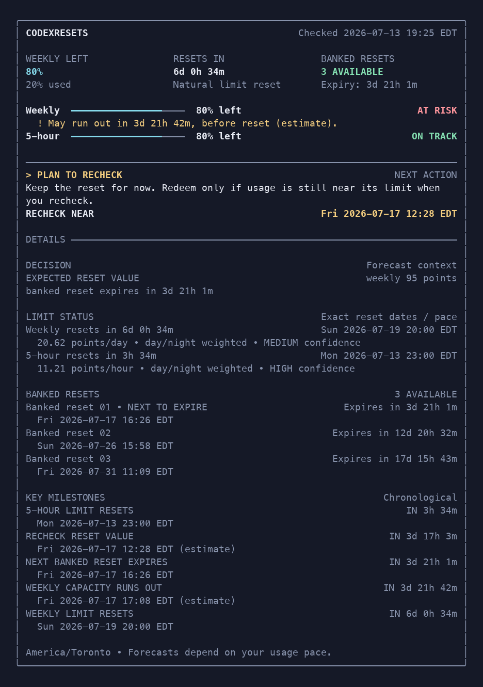
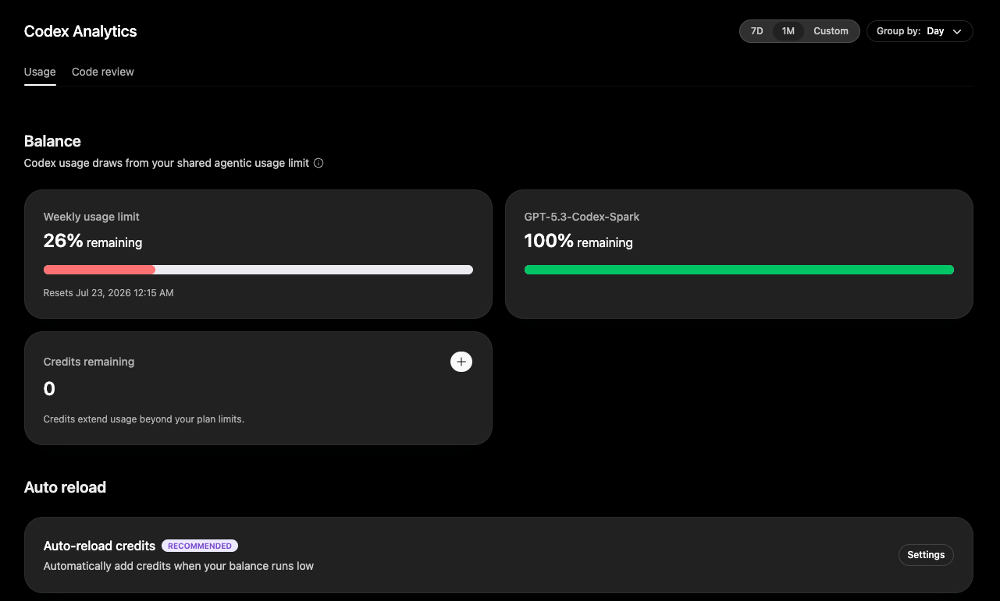

# CodexResets

See exactly when your Codex five-hour and weekly usage limits reset, then decide safely when a banked reset is worth using.



Install and run the CLI:

```bash
curl -fsSL https://raw.githubusercontent.com/maximpri/CodexResets/main/install.sh \
  -o codexresets-install.sh
bash codexresets-install.sh
codexresets
```

When `codex` is on `PATH`, the same installer also registers and enables the CodexResets plugin. Start a new Codex session after installation, then use `$codexresets:check-codex-resets` or `/skills`. Use `bash codexresets-install.sh --no-plugin` when you only want the standalone CLI.

> [!IMPORTANT]
> CodexResets is an independent community project, not an official OpenAI product. Live checks use the local Codex app-server; the optional custom-auth path uses undocumented ChatGPT endpoints. These interfaces may change. Use `/usage` in the Codex TUI for the supported OpenAI experience.

## Reproduce the demo

The screenshot shows the report shape. The command below renders a current report from the checked-in fixture without credentials, network access, or account changes:

```bash
node src/cli.mjs \
  --input test/fixtures/credits.json \
  --now 2026-07-13T23:25:36Z \
  --timezone America/Toronto \
  --color never \
  --width 80
```

The fixture, JSON output, and tests are the reproducibility harness for the project. Run the full verification suite with:

```bash
npm test
npm run check
npm run security:secrets
```

CodexResets makes no synthetic model-speed or cost claim. Its narrower, inspectable claim is that it reports the service's natural usage-window reset timestamps and keeps them separate from subscription timing, banked-reset expiry, and purchased credits. The live path reads the signed-in account; the fixture path makes the report logic auditable without sharing credentials.

## What it shows

- The exact next five-hour and weekly limit reset dates in your selected time zone
- Usage bars, remaining capacity, exact reset dates, pace confidence, and clear `ON TRACK` or `AT RISK` labels
- A concise next step whose wording reflects the forecast confidence
- The current subscription's renewal date or expiry date, when available
- The next banked-reset expiry and number of banked resets available
- A secondary Details section with chronological milestones, forecast methodology, and every banked reset

Normal reports never consume a banked reset, purchase usage credits, or change auto-reload settings. A due reset can be consumed only from an interactive table session after the user types the full word `yes` at the irreversible-action prompt.

## Example

This illustrative `--brief` excerpt keeps the natural usage reset and banked-reset expiry visibly separate:

```text
PLAN TO RECHECK
Next      Recheck Friday morning; redeem only if the reset value is worthwhile.

Weekly    26% left • 74% used
          resets Thu, Jul 23, 12:15 AM EDT • AT RISK
Plan      Pro expires Fri, Jul 17, 10:42 PM EDT (1d 6h 0m)
Forecast  Weekly capacity may run out Fri, Jul 17, 10:57 AM EDT • HIGH
Banked    expires Fri, Jul 17, 8:26 PM EDT • 1 available

Full      rerun without --brief
```

The weekly limit resets on July 23. Subscription access and the banked reset end earlier, so they become the effective planning boundaries without changing the underlying weekly usage-window reset.

<details>
<summary>Compare with Codex Analytics</summary>



Codex Analytics shows **Jul 23, 2026 at 12:15 AM**. CodexResets shows **Thu 2026-07-23 00:15 EDT**. Those timestamps match: `00:15` is 12:15 AM in 24-hour notation.

</details>

## Understand the dates

These values come from different account features and should not be compared with one another:

| CodexResets value | Meaning | Compare it with |
| --- | --- | --- |
| `WEEKLY LIMIT RESETS` | The natural reset of the weekly plan-usage window | Codex Analytics → **Weekly usage limit** → **Resets** |
| `5-HOUR LIMIT RESETS` | The natural reset of the rolling five-hour window | The corresponding five-hour usage display |
| `SUBSCRIPTION EXPIRES` | The end of a non-renewing subscription and the last planning boundary for a banked reset | ChatGPT subscription settings → current access end |
| `SUBSCRIPTION RENEWS` | The next billing-period boundary for a renewing subscription; it is not treated as an expiry | ChatGPT subscription settings → next renewal |
| `NEXT BANKED RESET EXPIRES` | The deadline to redeem a banked reset | The banked reset shown by Codex `/usage` |
| `Credits remaining` in Codex Analytics | Purchased or auto-reload usage credits | The Analytics credit balance; CodexResets does not fetch it |

When checking a weekly reset discrepancy, compare only the Analytics weekly-reset date with `weekly_usage.resets_at` in JSON or `WEEKLY LIMIT RESETS` in the table.

## Requirements

- macOS or Linux
- Node.js 18 or newer and npm
- Bash and curl
- A current Codex CLI sign-in (`codex login`)
- The `codex` executable on `PATH` for live reads and approved reset redemption

Default live checks use Codex app-server, which owns account selection and authentication. Only the optional `--auth-file` path requires a readable credential file; it uses the legacy direct-HTTPS client and disables redemption. Offline `--input` reports need neither Codex nor credentials.

## Install

### CLI

Download and run the installer:

```bash
curl -fsSL https://raw.githubusercontent.com/maximpri/CodexResets/main/install.sh \
  -o codexresets-install.sh
bash codexresets-install.sh
codexresets
```

You can inspect `codexresets-install.sh` before running it and delete it afterward. The installer never uses `sudo` or edits your shell profile. When plugin setup is enabled, it copies the bundled plugin to `~/plugins/codexresets`, updates the personal marketplace, and invokes `codex plugin add codexresets@personal`.

If the default npm location is not writable, install to your home directory:

```bash
CODEXRESETS_PREFIX="$HOME/.local" bash codexresets-install.sh
export PATH="$HOME/.local/bin:$PATH"
```

To update, download the installer again and rerun it. To uninstall:

```bash
npm uninstall --global codexresets
```

For a home-directory installation, add `--prefix "$HOME/.local"` to the uninstall command.

### Codex plugin

The quick installer installs the local plugin and exposes the `check-codex-resets` skill. If you skipped plugin setup or need to repair it, run:

```bash
codex plugin add codexresets@personal
```

Start a new Codex thread after installation so the skill is discovered. In Codex CLI, invoke it explicitly with the namespaced skill mention or use `/skills`:

```text
$codexresets:check-codex-resets When does my Codex weekly limit reset?
$codexresets:check-codex-resets Compare my weekly reset with Codex Analytics.

When does my Codex weekly limit reset?
Use $check-codex-resets to show my weekly usage and reset date.
Compare my weekly reset with Codex Analytics.
```

The `check-codex-resets` skill routes to the supported Codex app-server `account/rateLimits/read` method for live data, so Codex owns the active account session. It reports `weekly_usage.resets_at` first for weekly-reset questions and does not substitute a subscription or banked-reset expiry date when weekly usage is unavailable. A `LOW`-confidence recommendation is a provisional forecast, not a reason by itself to schedule a banked reset; the plugin should identify the natural reset and advise checking again closer to the projected limit. When a recommendation becomes due, the skill must show the confirmation prompt to the user and must not submit `yes` until the user explicitly approves using one banked reset.

## Use

Run the full terminal report:

```bash
codexresets
```

Read the report from the top:

| Area | What to look for |
| --- | --- |
| Top stats | Capacity left, time until the natural limit reset, and banked resets available. The capacity and countdown use the weekly window, or the five-hour window when weekly data is unavailable. |
| Capacity bars | Filled segments show **remaining** capacity. `AT RISK` means the forecast reaches the limit before the effective planning boundary. The warning states the estimated time left. |
| Next action | The highlighted recommendation and, when relevant, the time to recheck. Near-term banked-reset or subscription expiries also appear here. |
| Details | Muted exact timestamps, pace and confidence, expected reset value, full inventory, and chronological milestones. |

Colors reinforce the text labels; `--color never` keeps the same order and layout. Forecast dates are labeled as estimates. Expired service entries remain visible but are excluded from the available count and cannot be marked as the next reset. An available entry with missing or invalid expiry remains labeled `Expiry unknown`; check it in Codex before planning redemption.

Use `--brief` when you only want the next step, usage-window status, subscription timing, projected depletion, and next banked-reset expiry:

```bash
codexresets --brief
```

The brief layout is also selected automatically on terminals narrower than 68 columns. Times are shown in the selected local time zone; use `--timezone` when planning in another location.

### Interpret a reset recommendation

A future `PLAN TO RECHECK` message forecasts when usage may reach the 95% target if the measured pace continues. `RECHECK NEAR` gives the estimated time to check current usage again. When confidence is `LOW`, both report modes say `NO ACTION NOW` and ask you to recheck closer to the forecast date.

- `LOW` confidence commonly appears near the start of a window, when a small amount of early usage is being extrapolated across several days. Keep the banked reset and recheck instead of scheduling redemption from that estimate alone.
- `MEDIUM` and `HIGH` confidence reflect more observation, but the recommendation is still an estimate and should be checked against current usage when it becomes due.
- `--record` gives later reports useful historical samples, while `--watch 15m --record` can keep checking as the projection changes.

Also compare the recommendation with `WEEKLY LIMIT RESETS`. If the projected 95% point occurs shortly before the natural weekly reset, using a banked reset is useful only when uninterrupted capacity during that gap matters to you. When the banked reset remains valid after the natural reset, you can instead keep it, let the weekly window reset naturally, and reassess before the banked reset expires. The CLI cannot decide that personal tradeoff from percentages alone.

Default app-server reports may include the plan name without subscription dates; the CLI then makes no subscription cutoff assumption. With `--auth-file`, the legacy client first reads the signed `chatgpt_subscription_active_until` claim as the last confirmed end of subscription access. When richer metadata is available, a canceled subscription uses `active_until` as its expiry only with `will_renew: false`, while a renewing boundary is displayed as `SUBSCRIPTION RENEWS` and does not shorten the forecast. A banked-reset recommendation is moved before whichever confirmed cutoff comes first: subscription access ending or the reset's own expiry. If no subscription timing is available, the report continues without a subscription cutoff.

For an exact weekly reset value suitable for scripts, request JSON and read `weekly_usage.resets_at`:

```bash
codexresets --format json \
  | node -e 'let s=""; process.stdin.on("data", d => s += d).on("end", () => console.log(JSON.parse(s).weekly_usage?.resets_at ?? "unavailable"))'
```

Subscription-aware automation can read `subscription.expires_at`, `recommendation.deadline_at`, and `recommendation.deadline_type`. Each usage window also includes `planning_boundary_at`, `planning_boundary_type`, and `exhausts_before_planning_boundary`, so consumers can distinguish the natural reset from an earlier subscription cutoff. `subscription.will_renew: null` means renewal status is unknown; an access-end date may also be unavailable.

For banked resets, `available_count` excludes entries whose expiry is at or before `checked_at`. The `credits` array retains those service entries with `urgency: "EXPIRED"`, so its length can exceed the available count. `next_saved_full_reset` selects an available, unexpired entry, or an available entry with unknown expiry when no dated entry is usable. Unknown expiry is serialized as `expires_at: null` and `urgency: "UNKNOWN"` in the inventory. Credit expiry inputs accept ISO dates, Unix seconds, and Unix milliseconds, including numeric strings.

### Use a due banked reset

When `BANKED RESET READY` appears and a recommendation is due (`USE_NOW`, `USE_NEAR_LIMIT`, or `USE_BEFORE_EXPIRY` in JSON), an interactive table session explains the projected reset value and asks:

```text
Consuming it is permanent and cannot be undone.
Type "yes" to consume one banked reset now:
```

Only the full word `yes` approves the action. Any other answer leaves the reset untouched. After approval, CodexResets calls the documented Codex app-server `account/rateLimitResetCredit/consume` operation with a new idempotency key and refreshes the account report. See the [Codex app-server reset documentation](https://learn.chatgpt.com/docs/app-server#8-earned-rate-limit-resets-chatgpt).

Redemption is never offered when output is JSON, stdin/stdout is not a terminal, `--input`, `--now`, or a custom `--auth-file` is active, or `--no-redeem-prompt` is set. Custom auth files are excluded because Codex app-server must not accidentally act on a different signed-in account. A declined reset is not offered again during the same watch process.

To keep watching until the recommendation becomes due, leave an interactive watcher running:

```bash
codexresets --watch 15m --record
```

The watcher pauses at the same exact-`yes` permission prompt when it is time to use a reset.

Common examples:

```bash
codexresets --timezone Europe/London
codexresets --brief
codexresets --format json
codexresets --record
codexresets --watch 15m --record
codexresets --watch 15m --record --notify
```

Useful options:

| Option | Purpose |
| --- | --- |
| `--timezone <name>` | Display dates in an IANA time zone such as `UTC`. |
| `--brief` | Show a shorter summary instead of the full information-rich report. |
| `--format <type>` | Choose `table` or `json` output. |
| `--record` | Save a sanitized usage snapshot for better forecasts. |
| `--history` | Show a summary of saved usage history. |
| `--forget-history` | Delete saved usage history after validating it. |
| `--watch <duration>` | Refresh every `1m` to `24h` and print meaningful changes. |
| `--notify` | Ring the terminal bell when a watched recommendation changes. |
| `--no-redeem-prompt` | Disable interactive offers to consume a due banked reset. |
| `--auth-file <path>` | Use the legacy direct-HTTPS client with this credential file; disables redemption. |
| `--color <mode>` | Choose `auto`, `always`, or `never`. |
| `--width <40-120>` | Set report width; below 68 columns selects the brief layout. |
| `--ascii` | Use ASCII borders if box-drawing characters display poorly. |
| `--help` | Show every option. |

Credit IDs are hidden unless `--show-ids` is explicitly enabled. In table output, `--show-ids` forces the full report.

## Usage history

History is off by default. `--record` stores only timestamps, usage percentages, and reset times in `~/.codex/codexresets-history.json`. It does not store tokens, account details, credit IDs, raw API responses, or recommendations.

Once at least two useful snapshots exist, normal reports automatically use them to improve the forecast.

```bash
codexresets --record
codexresets --history
codexresets --forget-history
```

## Privacy and limitations

- Default reads start a local `codex app-server` process and request `account/rateLimits/read`. Codex manages the active account and session; CodexResets does not read its tokens for this path.
- With `--auth-file`, the legacy client reads the selected credential file locally and sends tokens only to fixed OpenAI and ChatGPT HTTPS endpoints.
- Tokens and raw authentication responses are never printed.
- Subscription output is limited to plan type, renewal state, and billing-period dates; subscription and account IDs are not rendered.
- The legacy custom-auth client may refresh the selected credential file, writing it atomically with file mode `0600`. Default session refresh is managed by Codex.
- Approved redemption starts the local `codex app-server` process and sends only the selected opaque reset ID plus a one-time idempotency key.
- Consuming a banked reset is irreversible. CodexResets requires an interactive exact-`yes` confirmation and refreshes limits after a successful or already-completed redemption.
- Codex app-server is an experimental interface and may change; use a current Codex CLI release.
- Forecasts are estimates. Usage patterns, subscription metadata, and undocumented service responses can change.
- Keep `--show-ids` off when sharing screenshots or logs.
- Never share `~/.codex/auth.json` or an unreviewed API response.

See [SECURITY.md](SECURITY.md) for security details and private vulnerability reporting.

## Troubleshooting

**Credentials not found:** Run `codex login` and confirm the CLI is signed into the intended account. If you explicitly use `--auth-file`, verify that the selected file exists and is readable.

**Session refresh failed:** Run `codex login` again, then retry.

**Live check or reset redemption cannot start:** Confirm `codex --version` works and that the Codex CLI is signed in with the same ChatGPT account.

**Borders or colors look wrong:** Run `codexresets --ascii --color never`.

**Weekly reset appears not to match Analytics:** Compare `WEEKLY LIMIT RESETS` with the reset date inside the **Weekly usage limit** card. Do not compare it with `NEXT BANKED RESET EXPIRES` or `Credits remaining`. Remember that `00:15` and `12:15 AM` are the same time.

**Banked reset shows a 1970 expiry:** Update CodexResets. Earlier versions treated app-server expiry timestamps in Unix seconds as milliseconds. The report now accepts ISO dates, Unix seconds, and Unix milliseconds, and excludes expired entries from availability.

**Service format changed:** Codex app-server and the legacy direct endpoints may change. Open an issue with sanitized output only—never attach credentials or a raw account response.

## Development

```bash
npm test
npm run check
npm run security:secrets
shellcheck install.sh codexresets.sh check-reset-credits.sh
```

`npm run security:secrets` checks tracked files, nonignored untracked files, and every
reachable Git revision without printing matched values. History coverage is limited
to revisions available in the clone; CI fetches full history before scanning. Ignored
files are intentionally excluded, so never force-add local credentials, saved API
responses, usage history, private keys, or package-manager authentication files.

Before publishing a package, use `npm pack --dry-run` to review its exact contents.
The npm allowlist in `package.json` excludes tests, screenshots, local data, and CI
configuration.

See [CONTRIBUTING.md](CONTRIBUTING.md) for contribution guidance and [CHANGELOG.md](CHANGELOG.md) for release notes.

## Maintainer launch checklist

Treat the README, installer, and first-run demo as the product surface:

- Test the copy-paste install on a clean macOS machine and a clean Linux machine. Watch a first-time user install it from scratch and fix every point where they get stuck.
- Reproduce the fixture demo and run `npm test`, `npm run check`, and `npm run security:secrets` before sharing a release or launch post.
- Share with one audience at a time: start with `r/LocalLLaMA`, then learn from the objections before moving to Show HN, Lobsters, `r/selfhosted`, or local-inference Discords. Tuesday–Thursday mornings ET are the intended launch window.
- Seed participation ethically by asking people who have actually seen or used the project to try it and share honest feedback. Never buy stars or ask for stars in the README or launch post.
- For the first two weeks after a launch, respond to every issue within a day and label concrete beginner-sized work `good first issue`.

Stars are a credibility and contributor signal, not the product goal. Optimize for a reproducible report, a clean install, and useful contributions; let the launch spike follow from that.

## License

[MIT](LICENSE)
